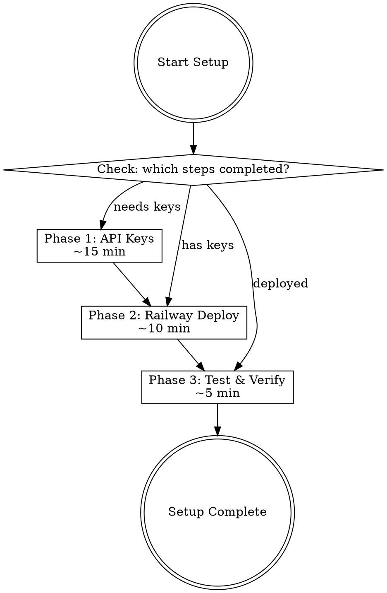

# Content Collection Bot Setup

Interactive setup wizard for the content-collection Telegram bot. Guides users through API keys, Notion database creation, Railway deployment, and verification.

**Repository:** https://github.com/ccccccarachen/content-collection

## Overview

The bot receives URLs/text via Telegram, uses Claude AI to generate titles and auto-categorize, then saves to a Notion database with columns: Title, Category, Added Time, Content. Users can change categories via number replies.

## Setup Flow



## Interactive Wizard

**IMPORTANT:** Run this as a conversation. Ask one question at a time. Validate each answer before proceeding. Celebrate wins.

### Step 0: Resume Check

Ask the user:
> Which of these have you already completed?
> 1. Anthropic API key
> 2. Notion integration + database
> 3. Telegram bot token
> 4. Railway deployment
>
> Reply with numbers (e.g., "1,3") or "none" to start fresh.

Skip completed steps.

### Phase 1: API Keys (~15 min)

#### 1A. Anthropic API Key

Ask:
> Do you have an Anthropic API key? Get one at: https://console.anthropic.com/settings/keys

**Validate format:**
```python
import re
valid = bool(re.match(r'^sk-ant-', key))
```

If invalid: "API keys start with `sk-ant-`. Double-check you copied the full key."

On success: "Anthropic API key validated. Save it somewhere safe - you'll need it for Railway."

#### 1B. Notion Setup (Most Complex)

This is the longest step. Follow `references/notion_setup.md` for detailed instructions. Summary:

**1B-i. Create Notion Integration:**

Ask:
> Go to https://www.notion.so/profile/integrations and click "New integration".
> - Name it "Content Collection Bot"
> - Select your workspace
> - Click Submit
>
> Copy the "Internal Integration Secret" and paste it here.

**Validate format:**
```python
valid = key.startswith("ntn_") or key.startswith("secret_")
```

On success: "Notion integration token saved."

**1B-ii. Create Database:**

Ask:
> Create a new **full-page database** in Notion with these exact columns:
>
> | Column | Type | Notes |
> |--------|------|-------|
> | Title | Title | Default first column |
> | Category | Select | Add your category options |
> | Added Time | Date | |
> | Content | Rich Text | |
>
> What categories do you want? (comma-separated)
> Example: Article, Video, Tweet, Tutorial, Resource, Personal, Other

Store their category choices. Instruct them to add each as a Select option in the Category column.

**1B-iii. Connect Integration to Database:**

Ask:
> On your database page, click "..." (top right) > "Connections" > find "Content Collection Bot" > confirm.
> Done? (yes/no)

**1B-iv. Get Database ID:**

Ask:
> Open your database as a full page. Copy the URL.
> It looks like: `https://www.notion.so/workspace/DATABASE_ID?v=VIEW_ID`
> Paste the URL or just the database ID here.

**Extract and validate:**
```python
import re
# Extract 32-char hex ID from URL or raw input
match = re.search(r'([a-f0-9]{32})', url_or_id.replace('-', ''))
if match:
    db_id = match.group(1)
    # Format with hyphens: 8-4-4-4-12
    formatted = f"{db_id[:8]}-{db_id[8:12]}-{db_id[12:16]}-{db_id[16:20]}-{db_id[20:]}"
```

If no match: "Couldn't find a valid database ID. The ID is the 32-character string in the URL before the `?v=` part."

On success: "Database ID extracted: `{formatted}`"

#### 1C. Telegram Bot Token

Ask:
> Open Telegram, message @BotFather, send `/newbot`.
> Follow the prompts to name your bot.
> Copy the token and paste it here.
>
> Token guide: https://core.telegram.org/bots#how-do-i-create-a-bot

**Validate format:**
```python
valid = bool(re.match(r'^\d+:[A-Za-z0-9_-]{35,}$', token))
```

If invalid: "Telegram tokens look like `123456789:ABCdefGHI...`. Make sure you copied the full token from BotFather."

On success: "Telegram bot token validated. All API keys collected!"

#### Phase 1 Complete

Show summary:
> **Phase 1 Complete!**
> - Anthropic API key: `sk-ant-...{last4}`
> - Notion token: `ntn_...{last4}`
> - Database ID: `{formatted_id}`
> - Telegram token: `{first_part}:...{last4}`
>
> Ready for deployment?

### Phase 2: Railway Deployment (~10 min)

#### 2A. Railway Account

Ask:
> Do you have a Railway account? If not:
> 1. Go to https://railway.com
> 2. Sign up (GitHub login recommended)
> 3. Free trial includes $5 credit
>
> Ready to deploy? (yes/no)

#### 2B. Deploy from GitHub

Ask:
> In Railway:
> 1. Click "New Project"
> 2. Select "Deploy from GitHub repo"
> 3. Connect your GitHub and select `content-collection`
> 4. Railway will auto-detect the Procfile
>
> Done? (yes/no)

#### 2C. Configure Environment Variables

Tell user:
> In Railway, go to your service > "Variables" tab. Add these 4 variables:

Then use the `scripts/create_railway_config.py` script to generate the config, OR instruct manually:

```
TELEGRAM_BOT_TOKEN = {their_token}
NOTION_TOKEN = {their_notion_token}
NOTION_DATABASE_ID = {their_db_id}
ANTHROPIC_API_KEY = {their_api_key}
```

Ask:
> All 4 variables added in Railway? (yes/no)

#### 2D. Verify Deployment

Ask:
> Go to your Railway service's "Deployments" tab.
> Click the latest deployment, then "View Logs".
> Do you see: `Bot started with AI-powered content summarization`?

If yes: "Deployment successful!"

If no: Check `references/troubleshooting.md` for common errors:
- `Missing environment variables` - variable names wrong or missing
- `401 Unauthorized` - invalid Notion token
- `Could not validate credentials` - invalid Anthropic key
- Build failures - check Python version

### Phase 3: Testing (~5 min)

#### 3A. Send Test Message

Ask:
> Open Telegram and find your bot (search for its username).
> Send it a URL, e.g.: `https://github.com/anthropics/claude-code`
> Did you get a response with a title and category?

#### 3B. Check Notion

Ask:
> Open your Notion database.
> Do you see a new entry with Title, Category, Added Time, and Content filled in?

#### 3C. Test Category Change

Ask:
> In Telegram, reply with a number from the category list shown after saving.
> Did the category update in both Telegram and Notion?

#### 3D. Test Pure Text

Ask:
> Send a plain text message (no URL) to the bot.
> E.g.: "Learn about vector databases for RAG applications"
> Did it generate a title and categorize it?

### Setup Complete

> **Your content collection bot is live!**
>
> Quick reference:
> - Send any URL -> auto-titled, categorized, saved to Notion
> - Send text before URL -> uses your text as the title
> - Send plain text -> AI generates title from your text
> - Reply with a number -> changes the category
>
> **Troubleshooting:** See `references/troubleshooting.md`
> **Notion details:** See `references/notion_setup.md`

## Validation

Run `scripts/validate_setup.py` to verify all connections:

```bash
python scripts/validate_setup.py
```

This checks: env var presence, API key formats, Notion connection, Notion DB structure, Anthropic API connectivity.

## Common Issues Quick Reference

| Symptom | Cause | Fix |
|---------|-------|-----|
| Bot doesn't respond | Not deployed / crashed | Check Railway logs |
| "Missing environment variables" | Env var not set | Check Railway Variables tab |
| Notion 401 | Bad token or not connected | Reconnect integration to DB |
| Wrong categories | DB schema mismatch | Check Category column is Select type |
| No Content column data | Column name mismatch | Must be exactly "Content" (rich text) |

See `references/troubleshooting.md` for full troubleshooting guide.
